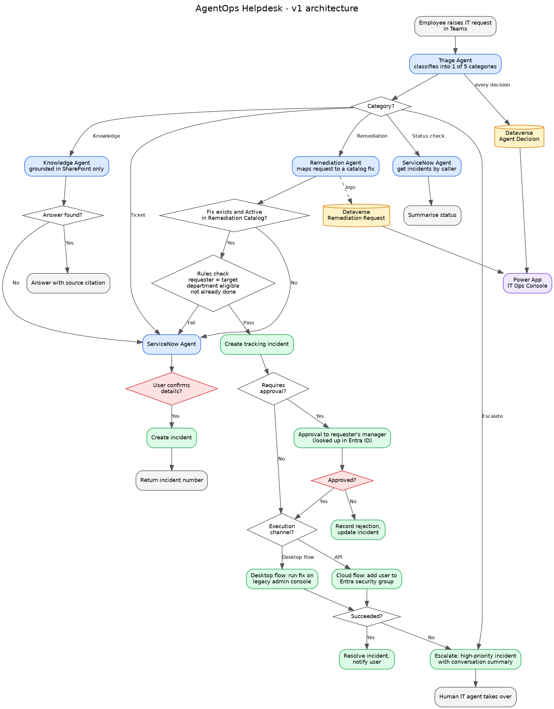

# Architecture

## End-to-end flow

Source: [architecture.drawio](diagrams/architecture.drawio) (open in draw.io) · [PDF](diagrams/architecture.pdf)

## Security model

The AI agent interprets the request; it never decides whether an action is allowed and never holds privileged access.

| Layer | Responsibility | Can a crafted message influence it? |
|---|---|---|
| Identity | Teams / Entra ID sign-in supplies the requester | No: comes from the platform |
| Intent | Agent maps the message to a catalog fix | Yes: so it has no power on its own |
| Eligibility | Flow rules: self-service only, department allowed, not already applied | No: deterministic |
| Business approval | Requester's manager, from Entra ID | Human decision |
| Execution | Dedicated service account with least privilege (e.g. owner of one group only) | Limited blast radius |
| Audit | Dataverse tables plus a ServiceNow incident | Recorded regardless |

## Environments

| Environment | Purpose |
|---|---|
| Portfolio-Dev | Build (developer environment) |
| Portfolio-Test | Deploy the managed solution to prove ALM |
